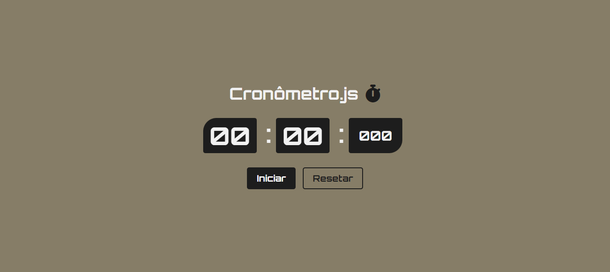

<h1 align="center">
  Cronômetro
</h1>

  

## Projeto - Cronômetro.js

Este projeto foi criado para simular um cronômetro que permite medir intervalos de tempo. Ele apresenta uma estrutura organizada, um design atraente e é totalmente responsivo, seguindo as práticas de código limpo.

Tecnologias Utilizadas:
* [HTML (Linguagem de marcação):](https://www.w3schools.com/html/html_intro.asp) Utilizado para estruturar e definir o conteúdo da página, incluindo cabeçalhos, parágrafos, listas e imagens.
* [CSS (Folha de estilos em cascata):](https://www.w3schools.com/css/css_intro.asp) Utilizado para estilizar os elementos da página, definindo cores, tamanhos, fontes e layout, proporcionando uma aparência visualmente atraente.
* [JavaScript:](https://developer.mozilla.org/pt-BR/docs/Web/JavaScript) Utilizado para adicionar interatividade à página, permitindo que o usuário selecione personagens e exiba informações dinamicamente.
* [Google Fonts:](https://fonts.google.com/specimen/Orbitron) Utilizado para acessar e aplicar fontes personalizadas aos textos da página, melhorando a estilização e a legibilidade.
* [Font Awesome:](https://fontawesome.com/icons) É um conjunto de ferramentas de fontes e ícones com base em CSS e LESS.
* [TinyJPG](https://tinyjpg.com/) e [TinyPNG:](https://tinypng.com/) O site utilizado é uma ferramenta online que comprime imagens JPEG e PNG sem perder muita qualidade. Ele reduz o tamanho dos arquivos de imagem usando algoritmos eficientes de compressão.

Créditos:
* Criado com base do Canal no YouTube | [Matheus Battisti - Hora de Codar](https://www.youtube.com/watch?v=6wd7PK3G7Zo&t=153s&ab_channel=MatheusBattisti-HoradeCodar)

Implantação do Projeto no Netlify: [Explore o projeto clicando aqui.]()

---

## Project - stopwatch.js

This project was created to simulate a stopwatch that allows you to measure time intervals. It has an organized structure, an attractive design and is fully responsive, following clean code practices.

Technologies used:
* [HTML (HyperText Markup Language):](https://www.w3schools.com/html/html_intro.asp) Used to structure and define page content, including headings, paragraphs, lists and images.
* [CSS (Cascading Style Sheets):](https://www.w3schools.com/css/css_intro.asp) Used to style the elements of the page, defining colors, sizes, fonts and layout, providing a visually appealing appearance.
* [JavaScript:](https://developer.mozilla.org/pt-BR/docs/Web/JavaScript) Used to add interactivity to the page, allowing the user to select characters and display information dynamically.
* [Google Fonts:](https://fonts.google.com/specimen/Orbitron) Used to access and apply custom fonts to page texts, improving stylization and readability.
* [Font Awesome:](https://fontawesome.com/icons) It's a set of font and icon tools based on CSS and LESS.
* [TinyJPG](https://tinyjpg.com/) e [TinyPNG:](https://tinypng.com/) The website used is an online tool that compresses JPEG and PNG images without losing much quality. It reduces the size of image files using efficient compression algorithms.

Credits:
* Created on the basis of the YouTube channel | [Matheus Battisti - Hora de Codar](https://www.youtube.com/watch?v=6wd7PK3G7Zo&t=153s&ab_channel=MatheusBattisti-HoradeCodar)

Project deployment on Netlify: [Explore the project by clicking here.]()
